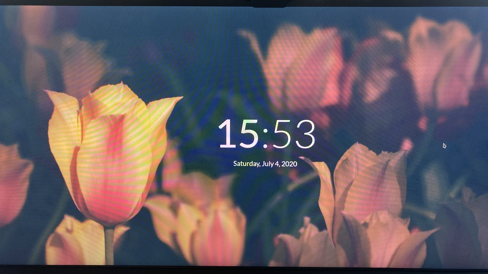

# dotfiles

A collection of dotfiles from my i3 setup

## Workflow


## Login Manager



---

Original Post: [https://www.reddit.com/r/unixporn/comments/hldbg7/i3gaps_j_i_l_l/](https://www.reddit.com/r/unixporn/comments/hldbg7/i3gaps_j_i_l_l/)

Original Comment:

```markdown

**Details:**

**OS:** Manjaro Linux

**WM:** i3-gaps

**Terminal:** URxvt + Oh-My-Zsh

**Sysinfo:** Neofetch

**Browser:** google-chrome-stable

**Music:** Spotify + [Spicetify](https://github.com/khanhas/Spicetify) ([Lacelove theme](https://github.com/morpheusthewhite/spicetify-themes)), Musixmatch

**Bar:** A modified version of [ngynLk's](https://github.com/ngynLk/polybar-themes) (check them out! Their themes are insanely good) blocks theme + [polybar-spotify-controls](https://github.com/dietervanhoof/polybar-spotify-controls)

**Dotfiles:** Coming soon

**Wallpaper:** [Jill](https://www.deviantart.com/koyorin/art/Jill-VA-11-Hall-A-641105485) by [koyorin](https://www.pixiv.net/en/users/12576068), I found the extended version [here](https://www.wallpaperflare.com/korarlin-anime-character-black-haired-female-anime-character-wallpaper-hqp)

**Colors:** All colors produced by Pywal, with tiny modifications made in .Xresources

**Bar Font:** SF Mono, Font Awesome 5, IPA Gothic

**Term Font:** Iosevka Bold

**Steam:** [wal\_steam](https://github.com/kotajacob/wal_steam)

**Launcher:** Rofi

---

**Bonus:**

**Login Manager:** [Lightdm-Webkit2](https://imgur.com/HOhj3Ib) (idk how to take screenshots of login manager lol)

**Greeter:** [Litarvan](https://github.com/Litarvan/lightdm-webkit-theme-litarvan)

**Wallpaper:** Taken from [addy-dclxvi's i3-starterpack](https://github.com/addy-dclxvi/i3-starterpack)
```

